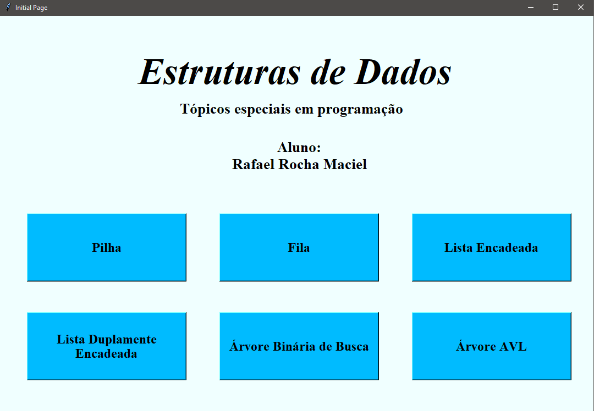
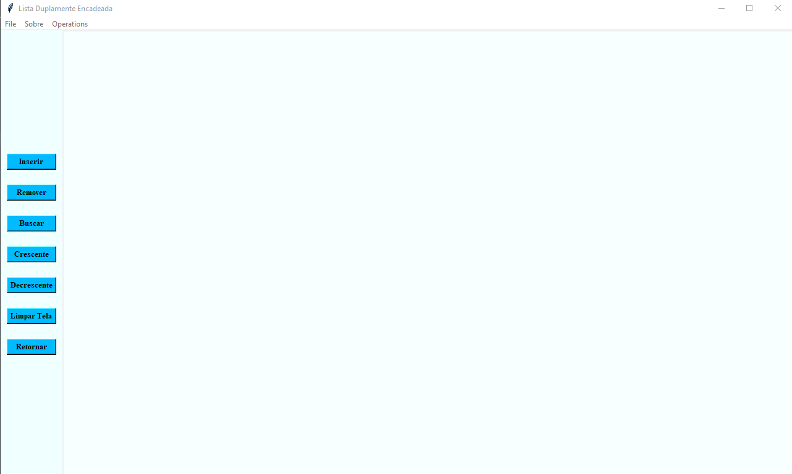

# Estruturas de dados em uma interface gráfica

Trabalho realizado na disciplina de Tópicos Especiais em Programação da Universidade Federal de Itajubá no ano de 2020.

O intuito do trabalho foi a criação de uma interface gráfica para demonstrar o uso de algumas estuturas de dados. Para a criação desse projeto foram utilizadas as bibliotecas Tkinter e Pillow.

## Tela Inicial

## Estruturas de dados

As janelas onde são executadas as estruturas tem a seguinte aparência:

No menu Sobre é apresentado uma descrição da estrutura, e como simular o seu funcionamento. 

## Considerações

Este trabalho foi realizado para enfatizar os conceitos aprendidos na disciplina. Algumas funções podem apresentar alguns bugs em seu funcionamento. 

Pretendo atualizar o código, refatorando as funções utilizando alguns conceitos de "Clean Code" (Os quais eu não conhecia em 2020), para deixar o código mais fácil de ser entendido.